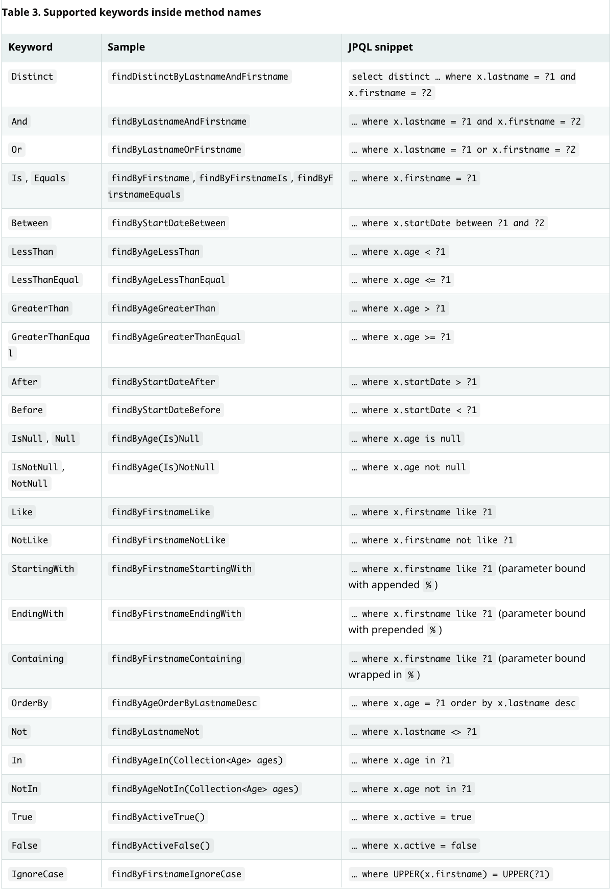
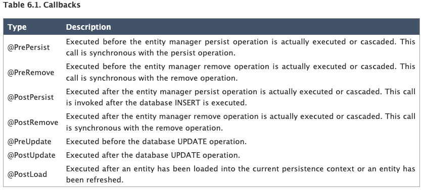
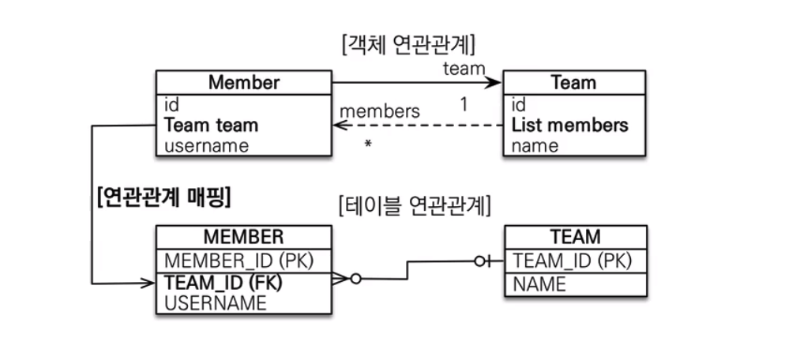
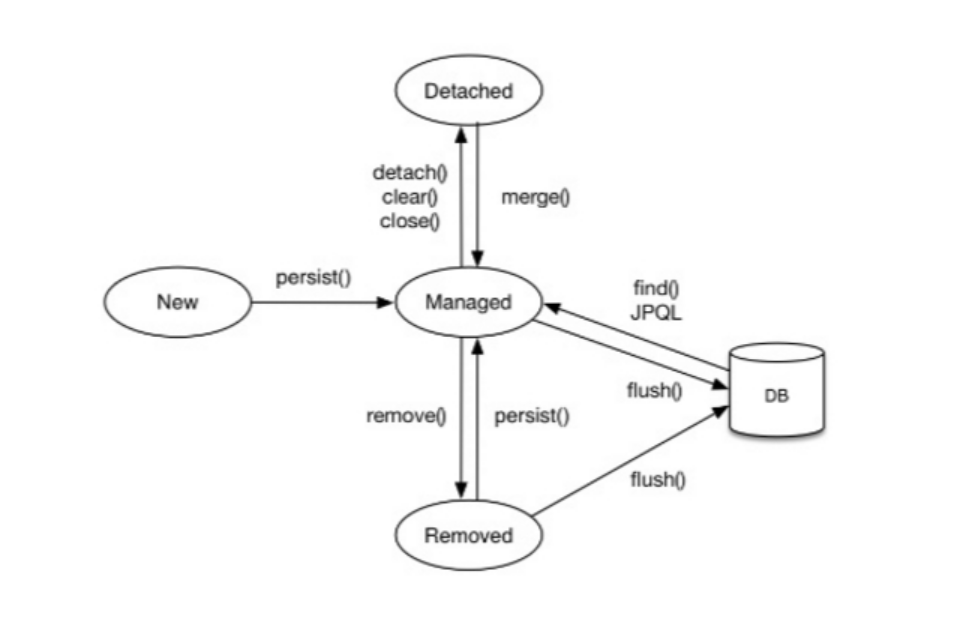

# springboot-jpa
JPA 끄적끄적

---
## 필요 개념
### Entity
* DB에 저장하기 위해 유저가 정의한 클래스 -> Domain
* 일반적으로 RDBMS에서 Table을 객체화
* [Entity & Mapping 참고자료](https://gmlwjd9405.github.io/2019/08/11/entity-mapping.html)
  * `@Transient` : 필드에 매핑(x), 객체에 임시로 보관
  * `@Enumerated` : `EnumType.STRING`-> enum 이름을 데이터베이스에 저장
  * `@Column`
    * `name` : 필드에 매핑할 테이블 컬럼 이름
    * `nullable`
    * `unique` : `@Table`의 `uniqueConstraints`와 같지만, 한 컬럼에 대한 제약조건
  * `@GeneratedValue`
    * `IDENTITY` : 기본 키 생성을 데이터베이스에 위임(=`AUTO_INCREMENT`)
    * `SEQUENCE` : 데이터베이스 시퀀스를 사용해서 기본 키 할당
    * `TABLE` : 키 생성 테이블 사용
    * `AUTO` : 데이터베이스 방식에 따라 자동 선택(`Default`) -> ex) MySQL -> IDENTITY
---
### JPA CRUD
* JpaRepository interface 상속(Repository)
  * 기본적으로 CRUD가 가능하도록 제공.
  * Spring Data JPA에서ㅓ 제공하는 JpaRepository 인터페이스 상속 시, @Repository (x)
  ```java
    public interface UserRepository extends JpaRepository<User, Long> {
    //  Generic <T, ID(PK 값)>
    //     T : Entity Type
    //     ID : 식별자 Type(PK)
  }
  ```
* 주요 Method :
  * getOne() vs findById()
    * getOne() : 대상 Entity에 대한 Lazy Load. 객체의 속성에 엑세스할 필요 없는 경우.
    * findById() : 주어진 ID에 대한 Entity 실제 로드. 모든 속성에 엑세스할 수 있도록 객체 로드.
  * save(S) : 새로운 것 -> 저장, 이미 존재 -> 병합
  * delete(T) : 삭제
  * findAll : Sort or Pageable 조건을 파라미터로 제공할 수 있음.

* [쿼리 메소드 필터 조건 공식 문서](https://docs.spring.io/spring-data/jpa/docs/current/reference/html/#jpa.query-methods.query-creation)
  * Spring Data JPA -> Method name을 분석하여, JPQL을 생성 후 실행 -> 코드 간결
  
  
---
### Embedded H2
* `H2 Database` : 자바 기반의 초 경량 RDBMS. 인 메모리 기반, JDBC API 지원, 브라우저에서 접속 가능한 콘솔 제공.
* `JPA` : `Hibernate` 추상화한 `interface` -> `JPA`와 `Hibernate`는 호환성이 잘됨,
* `Spring Starter` 에 구현체가 기본적으로 포함.
* `application.yml` 설정
  ```yaml
    spring:
      h2:
        console:
          enabled: true  -> 콘솔 실행
      jpa:
        show-sql: true  -> 실행 sql문 로그
        properties:
          hibernate:
            format_sql: true -> 로그 띄우기
  ``` 
* `intellij database` 설정
  * server 실행 시 H2 URL 복사 -> 우측 상단 Database 탭 URL 복사
---
### Entity Listener
* Entity의 변화를 감지해 같은 테이블과 다른 테이블 모두 데이터를 조작
* [Hibernate docs - callback methods](https://docs.jboss.org/hibernate/stable/entitymanager/reference/en/html/listeners.html)

* `listener Class`에는 의존성이 주입되지 않음 -> `BeanUtils` Component Class
  ```
    @Component
    public class BeanUtils implements ApplicationContextAware {
    private static ApplicationContext applicationContext;

        @Override
        public void setApplicationContext(ApplicationContext applicationContext) throws BeansException {
            BeanUtils.applicationContext = applicationContext;
        }

        public static <T> T getBean(Class<T> clazz){
            return applicationContext.getBean(clazz);
        }
    }

  ```
* BaseEntity Class
  * `@MappedSuperclass` : JPA Entity `createDate`, `modiifiedDate`를 컬럼으로
  * `@EntityListeners(AuditingEntityListener.class)` : Auditing 기능 사용
  * `@CreatedDate`, `@LastModifiedDate`
---
### Relation
* `@OneToOne`
  * 일대일 단방향 관계를 매핑, `@JoinColumn` 적용
  * 반대편에 `mappedBy` 적용 시, 양방향 관계 매핑 + 읽기 전용 필드
    * 주인은 `mappedBy` 속성을 사용하지 않음
    * 연관관계의 주인을 정할 수 있음

* `@OneToMany` -> 권장(x)
  * `Team`이 `Member`를 알고싶은데, 역은 알고 싶지 않음.


  

  * `1:N 단방향` -> 일(1)이 연관관계 주인 -> 보통 테이블 관점에서 외래키(N), 1쪽에서 관리하겠다.
  * `Transaction commit` -> `create one-to-many` 주석과 `update` 쿼리 동작 -> 성능상 좋지 않음
  * `@JoinColumn`을 꼭 사용 -> 아닐 시, 중간 테이블이 하나 추가됨
  * `해결 방법`
    * 객체 입장에서 보면, 반대방향으로 참조할 필요가 없는데 관계를 하나 더 만드는 것이지만, DB 입장으론 설계의 방향을 조금 더 맞춰서 운영상 유지보수 쉬움.
    * `insertable`, `updatable`를 `False` -> `read` 전용으로 만듬(공식 x)
    * `N:1` 방법으로 사용하도록 권장 -> 필요할 경우 양방향 매핑
    

* `@ManyToOne`
  * @`Optional`
  * DB 설계 상 1:N에서 N에 (외래키) 저장. 
  * `NullPoint Exception`을 방지하기 위해 new arrayList<>(); -> 선언


* `@ManyToMany`
  * 현업에서 자주 사용하진 않음.
  * Ex) `User`, `Product` -> `user_product` (x) 중간 테이블을 생성하지 않음.
  * `Order` Table을 1:N, N:1로 각각 매핑해서 만들어 연결.
  
### MySQL DB 연결
* `Dialect` : 각 `DBMS`마다 `Query`를 맞춰주는 용도
  ```yaml
  jpa:
    generate-ddl: true # 자동으로 Entity를 ddl
    hibernate:
      ddl-auto: create-drop
  datasource:
    url: jdbc:mysql://localhost:3306/사용databasename
    username: root
    password: pwd
    initialization-mode: always
  ```
  
### 영속성 컨텍스트 : `Entity`를 영구 저장하는 환경
* `em.persist(member)` 
  * 엔티티 매니저를 통해 회원 엔티티를 영속성 컨텍스트에 저장


* 엔티티 생명주기
  * `비영속(new/transient)`: 관계 없는 상태
    ```java
    Member member = new Member();
    ```
  * `영속(managed)` : 영속성 컨텍스트에 저장된 상태
    ```java
    en.persist(member);
    ```
  * `준영속(detached)` : 저장되었다가 분리된 상태
    ```java
    // 엔티티를 컨텍스트에서 분리  
    em.detach(member);
    // 컨텍스트를 비워도 준영속 상태  
    em.clear();
    // 컨텍스트를 종료해도 준영속 상태
    em.close();
    ```
    * 1차 캐시, 쓰기 지연, 변경 감지, 지연 로딩을 포한한 어떠한 기능 제공 x
  * `삭제(removed)` : 삭제된 상태
    ```java
    em.remove(member);
    ```

* `em.flush()` : 영속성 컨텍스트의 변경 내용을 DB에 반영




* 영속성 컨텍스트가 엔티티를 관리하면 좋은 점
  * 1차 캐시, 동일성 보장, 트랜잭션, 변경감지, 지연로딩

## 실행 오류
* ['dataSourceScriptDatabaseInitializer' defined in class path resource](https://www.inflearn.com/questions/224708)
 : application.yml DB 테이블 자동 생성 오류, data.sql -> import.sql 파일 이름 변경. spring 2.5.0 버전부터 사용법 바뀜


* [JpaSystemException: could not execute statement; nested exception...](https://snepbnt.tistory.com/302)
  * 테스트코드 Junit 실행시 예외가 발생하는 경우,
  * repository 관련 클래스를 실행할 때 예외가 발생하는 경우
  * 쿼리 실행할 수 없는 문장이라는 말
  * <strong><u>해결 방법<u/>
    * `Entity`에 `Not Null` 옵션을 달고, `Null` 값이 들어가게 설계하는게 가장 일반적이다.
    * `Auto_Increment` 설정 -> 자동으로 값이 채워지게.

* 순환 참조 : `1:N`, `N:1`, `양방향 관계` 에서 발생<br/>　　　　　`@ToString.Exclude`이용하여 끊어주면 됨.

